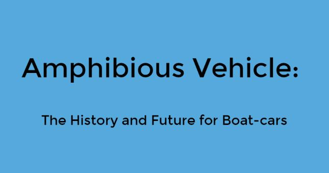
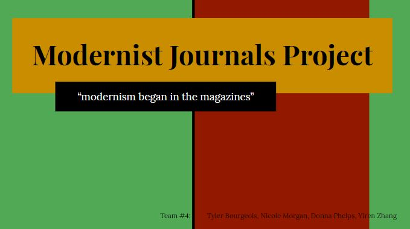

# IASC 2P02 | Yiren Zhang

## Bio

I am a fourth year student in the IASC program at Brock University. My research areas are Media Production, Virtual Reality and 3D Designing. During this class, my researches fields are exploring the Modernist Journals Project, writing academic post and doing academic researches for amohibious vehicle's development, and my research program involves making PowerPoint slides and academic researches with text analysis tools. This research focuses are reflected in my projects in this portoflio, such as my featured project which talk about the history of amphibious vehicle. Similarly, group project Modernist Journals Project looks at Initial Researches and Findings. In the future, I would like to continue my researches like filming, video editing and developments for VR stuff. I want to be a videographer or photogragher to combine my work and my life together.

## Featured Project: [Amphibious Vehicle: The History and Future for Boat-cars]

This is a 15x20 Pecha Kucha presentation about the history and futures of amphibious vehicle's evolution. This was my first time to hear and to experience the Pecha Kucha presentation. I did a lot of academic researches and read related articles about amphibious vehicle. I also learned how to add pictures, texts and edit slides on reveal.js and learned how to present a Pecha Kucha Presentation by watching Youtube and visit their official website. However, I still had some misunderdtandings for both of syllabus and Pecha Kucha Presentation itself.

Based on the professor's feedback, I almost changed everything for my presentation slides,which you can see [here](https://slides.com/alani-jenchang/deck-1-2#/). I followed Pecha Kucha format to delete most of texts, expand pictures, and made slides can auto advance to show now. You can compare with the [old](https://slides.com/alani-jenchang/deck-1#/) one. Overall these changes show both inside and outside changes in my thinking and I would like to make a Pecha Kucha presentation again in the future if I have chance.

## Collaborative Project:Modernist Journals Project

The Modernist Journals Project(MJP) is a multi-faceted project that aims to be a major resource for the study of modernism and its rise in the English-speaking world, with periodical literature as its central concern. The historical scope of the project has a chronological range of 1890 to 1922, and a geographical range that extends to wherever English language periodicals were published. With magazines at its core, the MJP also offers a range of genres that extends to the digital publication of books directly connected to modernist periodicals and other supporting materials for periodical study.

For this group project, we contributed our works on the Google drive and we contact each other by sending emails. I found related information and putted them together in the Powerpoint for each slides. I approach collaboration in many ways, which is reflected in the Introduction (available [here](https://docs.google.com/presentation/d/1K_w0ljlTMxzwfYLaGKy1qS0yovBPPB5DO-beAu8LsIs/edit#slide=id.g4eb4df3e41_0_119)). I also approach collaboration in another ways, which is reflected in Initial Reserach and Findings (available [here](https://docs.google.com/presentation/d/1K_w0ljlTMxzwfYLaGKy1qS0yovBPPB5DO-beAu8LsIs/edit#slide=id.g4ed3d71a8f_0_55)). 

## Research Presentation

[Amphibious Vehicle: The History and Future for Boat-cars](http://slides.com/alani-jenchang/deck-1-2?ref=share#/)

## Academic Blog

[Blog post](https://github.com/alanyasuto/IASC-2P02/blob/master/Blog%20Post.md)
